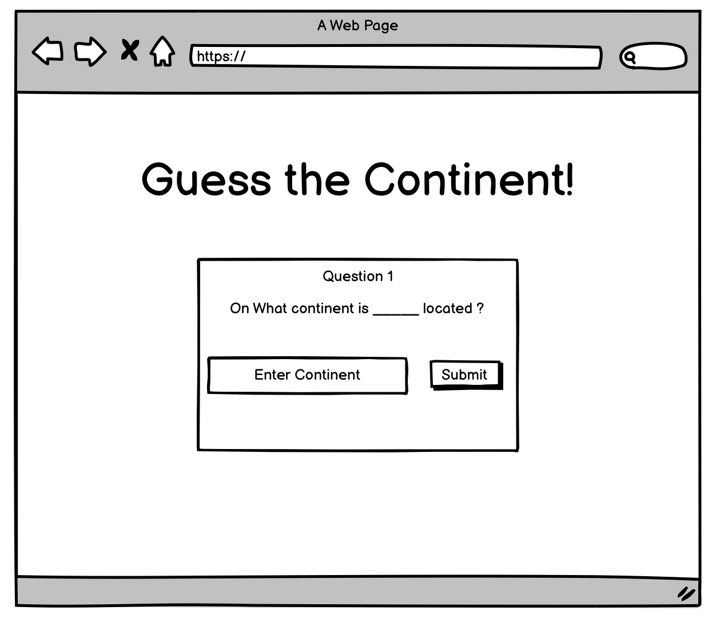
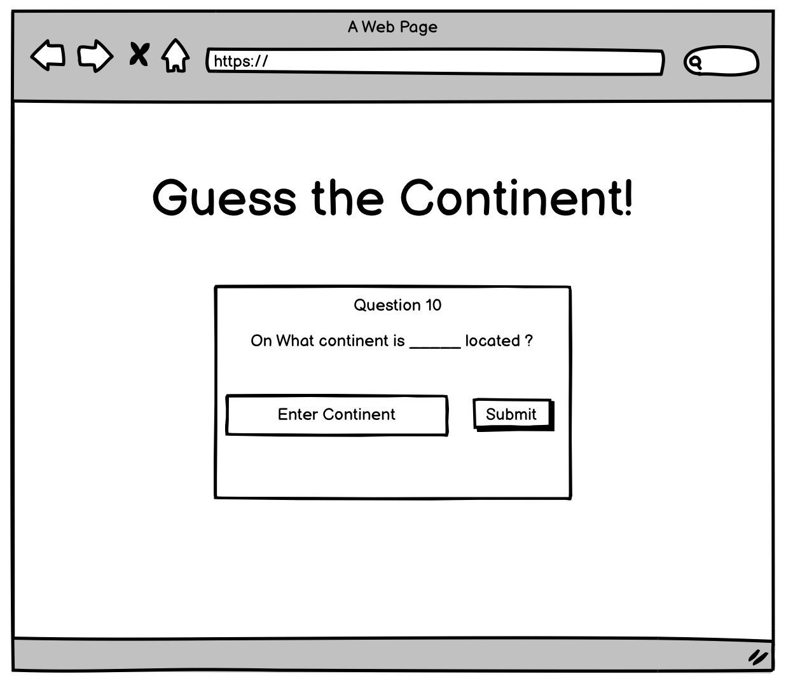
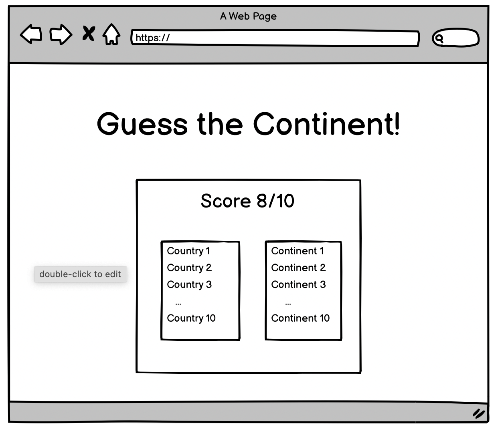

# Guess The Region
 

## Game Discription

This is a geography trivia game. You will be promped a question and expected to give an input. The gave will go on for a set amount of questions and then will output your total score and a list of the questions and their correct responces letting the user know which ones they answered correctly.

The questions would be formated where the player is given a country name and is then prompted to give the region that said country is located on.

---
## Thechnologies

- Javascript
- HTML
- CSS

---
## User Stories

**MVP**

- As a player, I want the country name displayed 
- As a player, I what to be able to guess an answer
- As a player, I what to know if the answer is correct
- As a player, I what more than one question
- As a player, I want to keep track of score
- As a player, I what to know if they're are more questions coming
- As a player, I want to know the correct answer to the questions i got wrong

**Bronze**:

- As a player, I want a hint
- As a player, I want multiple guesses for each question.
- As a player, after a game ends, I want a "Play again" button so that I can begin another game.
- As a player, I want to choose the how many questions i want to answer

**Silver**:

- As a player, I want the game to keep track of past games so I can keep track of my wins.
- As a player, I want I want to toggle between timmed test and unlimited tests

**Gold**:

- As a player, I want the game to share my wins on social media so everyone can know how good I am.
- As a player, I want to be able to play the game in the language that I speak, so that I can fully understand the game.
- As a player, I want I want a picture to be displayed with the country name
- As a player, I want a picture of the country
- As a player, I want picture of a famous landmark of in the country
- As a player, I want A picture of the geographical location (as a hint)
- As a player, I want I want to choose what to guess:
- As a player, I want to guess the capital
- As a player, I want Multiple choices for guesses 

## Wireframes

---
## Challenges

While making this game I faced a few hurdles that I had to overcome. One that I did not resolve was displaying multiple choice options. Instead I created a dropdown list. This was only successful because all the questions had the same possible answers and would not have worked otherwise. 

I also struggled with creating the final 'Game Over' screen where the correct answers are compared to the player's responses. I was able to figure it out by using the 'display: none' CSS method and changing it to 'display: flex' when the game was over. One thing I plan on adding is a clear distinction in the questions letting the player know which questions they answered correctly vs incorrectly.
